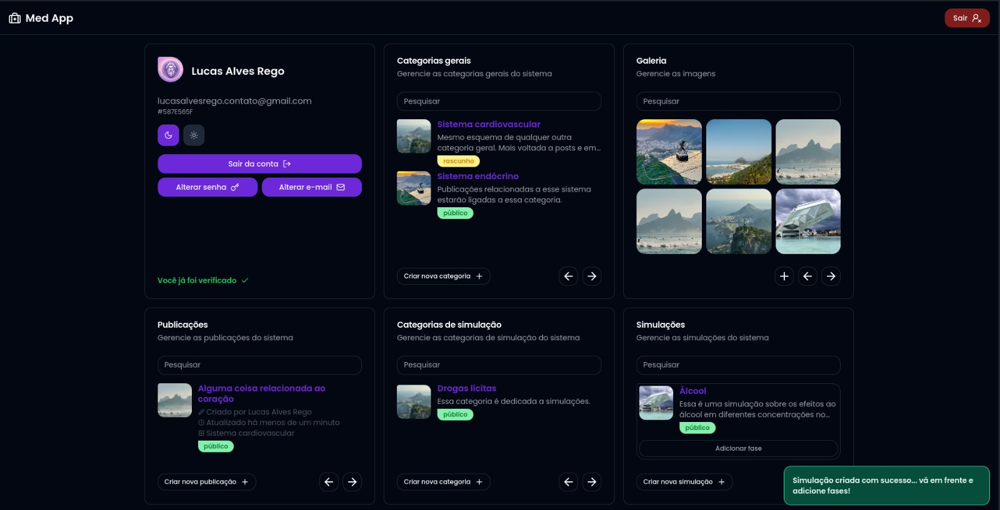
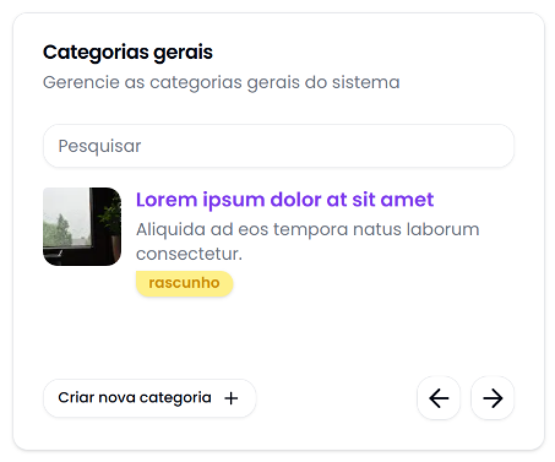

# MANUAL DE USO DA APLICAÇÃO ADMINISTRATIVA

> [!WARNING]
> A aplicação disponível no momento não está pronta para uso. Estamos trabalhando para finalizar o desenvolvimento e disponibilizar a aplicação o mais rápido possível.

A aplicação administrativa é feita para uso interno. Nela um usuário administrador pode gerenciar os dados do banco de dados, como usuários, categorias, publicações, etc.

Para acessar a aplicação, você precisa de um usuário administrador. A aplicação possui um sistema de cadastro, mas usuários cadastrados não tem permissão para adicionar, remover ou alterar nenhum dado, então o primeiro usuário precisa ser alterado diretamente no banco de dados.

Usuários administradores podem então alterar os dados do banco de dados, alterar outros usuários, categorias, publicações, etc.

## Como utilizar a aplicação

1. Acesse a aplicação em [`http://localhost:3000/admin`](http://localhost:3000/admin) durante desenvolvimento e [`devmed.online`](devmed.online) em produção.

2. Faça cadastro com um e-mail, senha e o seu nome.

4. Após o cadastro, você receberá um e-mail de confirmação. Clique no link para confirmar o e-mail. Essa etapa é importante para garantir que o e-mail é válido.

5. Após o cadastro, você será redirecionado para a tela de login. Faça login com o e-mail e senha cadastrados.

6. Após o login, você será redirecionado para a tela de inicial da aplicação. Nessa tela você pode ver algumas informações sobre o projeto e capturas de tela do aplicativo.

7. No canto inferior direito, você pode ver um botão com as iniciais do seu nome. Clique nele para acessar a página administrativa.

8. Na página administrativa, você pode ver uma grade de cartões com diversas funcionalidades da aplicação. A maior parte dos pontos de acesso estão nesta única página.

9. O primeiro cartão é o do seu perfil. Nele você pode ver sua situação cadastral, um botão para alterar sua senha, outro para alterar seu e-mail e um botão para sair da aplicação.

Nessa parte você também pode alterar sua preferência de tema. A aplicação possui dois temas, claro e escuro.

10. O segundo cartão é o de categorias gerais. Nesse cartão você possui um campo para pesquisar categorias, uma listagem com imagem, nome, descrição e estado de publicação de cada categoria.

Na parte mais a baixo, você pode adicionar uma nova categoria. Basta clicar no botão "Criar nova categoria" e uma caixa de dialogo será aberta.

Agora basta criar a categoria com nome, descrição e imagem.

Parar adicionar uma imagem é disponibilizado uma outra caixa de dialogo para selecionar uma imagem existente no banco de imagens, denominado de "Galeria" ou fazer o upload de uma nova imagem.

> [!NOTE]
> A funcionalidade de upload de imagens é descrita no ponto 11.

Após preencher com os dados necessários, clique em "Salvar" para adicionar a categoria.

Com uma categoria geral adicionada, você pode realizar ações de edição, exclusão e alteração de estado de publicação.

Ao passar o mouse sobre a imagem de uma categoria você verá três botões. O primeiro é para editar a categoria, o segundo é para excluir a categoria e o terceiro é para alterar o estado de publicação da categoria.

Ao clicar no botão com o ícone de lápis, será aberta uma caixa de dialogo com os dados da categoria. Nessa caixa você pode alterar o nome, descrição e imagem da categoria. Esse processo é o mesmo para adicionar uma nova categoria.

Ao clicar no botão com o ícone de lixeira, será aberta uma caixa de dialogo de confirmação. Clique em "Sim" para excluir a categoria. Uma categoria não é excluída se houver publicações associadas a ela.

Como alternativa a exclusão, você pode clicar no botão com o ícone de olho. Isso altera o estado de publicação da categoria. Uma categoria não é exibida no aplicativo se o estado de publicação for "rascunho". Um indicador visual é exibido na categoria para mostrar o estado de publicação.

No canto inferior direito do cartão de categorias, próximo ao botão de adicionar uma nova categoria, você pode ver um par de botões para navegar entre as páginas de categorias. A aplicação exibe 3 categorias por página. Alterar a página atualiza apenas o conteúdo do cartão de categorias.
