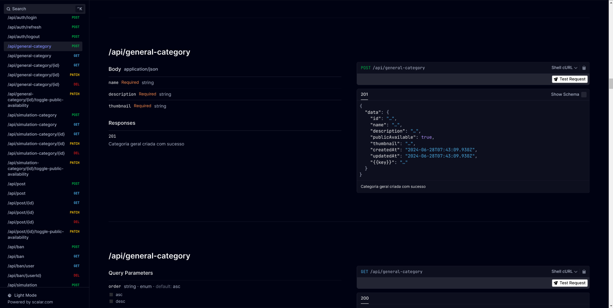

# Como utilizar a API

A API é feita para uso interno, tanto do aplicativo, quanto da interface administrativa. Ela é responsável por fazer a comunicação entre o banco de dados, serviços externos e as aplicações que consomem os dados.

A aplicação é feita com a linguagem Typescript e utiliza o framework [NestJS](https://nestjs.com/). Como o banco de dados é SQLite, não é necessário instalar nenhum banco de dados adicional. A integração com o banco é feita com o ORM [Prisma](https://www.prisma.io/).

## Como rodar

Esse passo a passo você pode encontrar no arquivo [README.md](./README.md) na raiz da documentação.

## Endpoints

Após executar a aplicação, você pode acessar a documentação dos endpoints em [`http://localhost:2309/api/reference`](http://localhost:2309/api/reference).

A documentação está disponível como um schema OpenAPI, então você pode importar em ferramentas como o [Postman](https://www.postman.com/) ou [Insomnia](https://insomnia.rest/).

Além disso você pode consultar a documentação diretamente no navegador.



## Autenticação

A API utiliza autenticação via JWT. Para acessar os endpoints protegidos, você precisa enviar o token no header. Você também precisa enviar um Refresh Token para obter um novo JWT pois o tempo de vida do token de acesso é reduzido para aumentar a segurança.

Para gerar um token de acesso, você precisa fazer uma requisição para o endpoint `/api/auth/login` com o email e senha do usuário. O token de acesso e o refresh token serão retornados na resposta. O token de acesso deve ser enviado no header `Authorization` com o valor `Bearer <token>`. O refresh token deve ser enviado no header `Refresh` com o valor `Refresh <refresh_token>`.

Outra opção é enviar o token de acesso no cookie `access_token` e o refresh token no cookie `refresh_token`. O nome pode ser alterado no arquivo `.env.local` no subrepositório `api`. O arquivo `.env.local` deve conter as seguintes variáveis:

```env
JWT_COOKIE_NAME=access_token
JWT_REFRESH_COOKIE_NAME=refresh_token
```

Para gerar os segredos dos tokens é recomendado que você gere um segredo forte. Você pode gerar um segredo com o comando `openssl rand -base64 32`. O segredo deve ser colocado no arquivo `.env.local` no subrepositório `api`.

```env
JWT_SECRET_KEY=/hP2akWU8ZBrEpsxr9r5UhcDhiDbZTteoidEqFNQYbk=
JWT_REFRESH_TOKEN_SECRET_KEY-Uds9vk4i82EmFVcALKf+Sk57lpsqxw2xJGJg1SXVuqk=
```

Gerar um segredo forte é importante para garantir a segurança dos tokens. Se possível gere um segredo com mais de 32 bytes.
